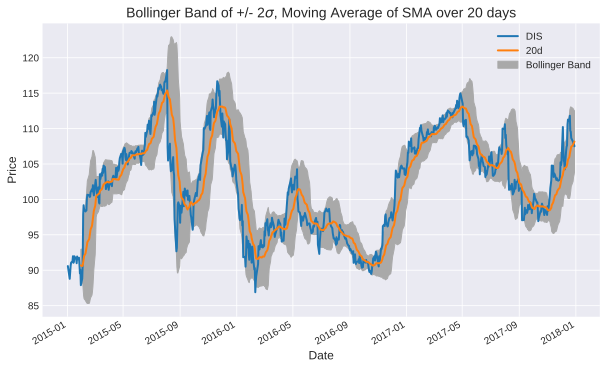
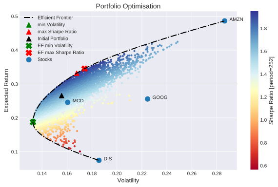

# QuantPy

`QuantPy` is a program for financial portfolio management. It combines various stocks/funds to form a portfolio. Most common quantities, such as Expected annual Return, annual Volatility, and Sharpe Ratio are computed as the portfolio object is being created. It also facilitates modules for quick and easy computations and visualisations of risk analysis, buy/sell signals and optimised portfolios for a set of optimisation functions.

`QuantPy` was designed to be an user-friendly program. While it provides the user with a set of useful modules that can be used manually, it also provides an object that holds the data -- stock prices of the portfolio -- including interfaces to the aforementioned modules.

**Note**: Throughout this README, `pf` refers to the object `quantpy.portfolio.Portfolio`, the object that holds all stock prices and computes its most common quantities automatically. To make `QuantPy` an user-friendly program, that combines data analysis, visualisation and optimisation, the object provides interfaces to the main features that are provided in the modules in `./quantpy/` and are discussed below.

## Motivation
Within a few lines of code, `QuantPy` can generate an object that holds your stock prices of your desired financial portfolio, analyses it, and can create plots of different kind of *Returns*, Moving Averages*, bands of *Moving Averages* with buy/sell signals, *Bollinger Bands*. It also allows for the optimisation based on the *Efficient Frontier* or a *Monte Carlo* run of the financial portfolio within a few lines of code. Some of the results are shown here.

Let `pf` be an instance of `quantpy.portfolio.Portfolio`, which contains the prices of the stocks in your portfolio.
### Cumulative Return
```
pf.compCumulativeReturns().plot().axhline(y = 0, color = "black", lw = 3)
```
yields
<p align="center">
  
</p>


### Band Moving Average (Buy/Sell Signals)
```
from quantpy.moving_average import computeMA, EMA
dis = pf.getStock("DIS").data.copy(deep=True)
spans = [10, 50, 100, 150, 200]
ma = computeMA(dis, EMA, spans, plot=True)
```
yields
<p align="center">
  
</p>

### Bollinger Band
<p align="center">
  
</p>

### Portfolio Optimisation
<p align="center">
  
</p>


## Table of contents
 - [Dependencies](#Dependencies)
 - [Usage](#Usage)
 - [Portfolio](#Portfolio)
 - [Returns](#Returns)
 - [Moving Averages](#Moving-Averages)
 - [Portfolio Optimisation](#Portfolio-Optimisation)
   - [Efficient Frontier](#Efficient-Frontier)
   - [Monte Carlo](#Monte-Carlo)
 - [Examples](#Examples)
   - [Building a portfolio with `quandl`](#Building-a-portfolio-with-quandl)
   - [Building a portfolio with preset data](#Building-a-portfolio-with-preset-data)
   - [Analysis of a portfolio](#Analysis-of-a-portfolio)
   - [Optimisation of a portfolio](#Optimisation-of-a-portfolio)

## Dependencies
`QuantPy` depends on the following Python packages:
 - python>=3.5.0
 - numpy>=1.11.0
 - pandas>=0.17.1
 - matplotlib>=1.5.1
 - quandl>=3.4.5
 - scipy>=1.2.0

## Usage
Download the code:

```git clone https://github.com/fmilthaler/QuantPy.git```

And make sure to add the directory `QuantPy` to your `PYTHONPATH`.

## Portfolio
This is the heart of `QuantPy`. `quantpy.portfolio.Portfolio` provides an object that holds prices of all stocks in your portfolio, and automatically computes the most common quantities for you. To make `QuantPy` an user-friendly program, that combines data analysis, visualisation and optimisation, the object provides interfaces to the main features that are provided in the modules in `./quantpy/` and are discussed below.

To learn more about the object, please read through the docstring of the module, and have a look at the examples.

Here is an incomplete list of functions provided within `pf`:
 - `getStock`: Returns the instance of a Stock
 - `compCumulativeReturns`: Cumulative Returns
 - `compDailyReturns`: Percentage change of daily Returns
 - `compDailyLogReturns`: Log Return
 - `compMeanReturns`: historical mean of the daily returns
 - `compExpectedReturn`: computes the Expected Return of the portfolio
 - `compVolatility`: computes the volatility of the given portfolio
 - `compSharpe`: computes and return the Sharpe ratio of the portfolio
 - `ef_minimum_volatility`: performs an optimisation for the portfolio with the minimum volatility
 - `ef_maximum_sharpe_ratio`: performs an optimisation for the portfolio with the maximum Sharpe Ratio
 - `ef_efficient_return`: performs an optimisation for the portfolio with the minimum volatility for a given target return.
 - `ef_efficient_volatility`: performs an optimisation for the portfolio with the maximum Sharpe ratio for a given target volatility.
 - `ef_plot_efrontier`: computes and plots the *Efficient Frontier* of the portfolio
 - `ef_plot_optimal_portfolios`: computes and plots markers of the two optimal portfolios (minimum volatility/maximum Sharpe ratio)
 - `plot_stocks`: plots all stocks of the portfolio (expected (annual) return over volatility)
 - `mc_optimisation`: performs a Monte Carlo run and finds optimised portfolios
 - `properties`: nicely prints out the portfolio's properties

`quantpy.portfolio.Portfolio` also provides a function `buildPortfolio` which is designed to automatically generate `pf` for the user's convenience. For more information on how to use `buildPortfolio`, please read its `docstring` (do `print(quantpy.portfolio.buildPortfolio.__doc__)`) and have a look at the examples.

## Returns
Daily returns of stocks are often computed in different ways. `QuantPy` provides three different ways of computing the daily returns in `quantpy.returns`:
1. The cumulative return: 
2. Percentage change of daily returns: 
3. Log Return: 

In addition to those, the module provides the function `historicalMeanReturn(data, freq=252)`, which computes the historical mean of the daily returns over a time period `freq`.

## Moving Averages
The module `quantpy.moving_average` allows the computation and visualisation of Moving Averages of the stocks listed in the portfolio is also provided. It entails functions to compute and visualise the
 - `SMA`: Simple Moving Average, and
 - `EMA`: Exponential Moving Average.
 - `computeMA`: a Band of Moving Averages (of different time windows/spans) including Buy/Sell signals
 - `plotBollingerBand`: a Bollinger Band for
   - `SMA`,
   - `EMA`.

## Portfolio Optimisation
### Efficient Frontier
An implementation of the Efficient Frontier (`quantpy.efficient_frontier.EfficientFrontier`) allows for the optimisation of the portfolio for
 - `minimum_volatility` Minimum Volatility,
 - `maximum_sharpe_ratio` Maximum Sharpe Ratio
 - `efficient_return` Minimum Volatility for a given expected return
 - `efficient_volatility` Maximum Sharpe Ratio for a given target volatility

by performing a numerical solve to minimise/maximise an objective function.

Often it is useful to visualise the *Efficient Frontier* as well as the optimal solution. This can be achieved with the following methods:
 - `plot_efrontier`: Plots the *Efficient Frontier*. If no minimum/maximum Return values are provided, the algorithm automatically chooses those limits for the *Efficient Frontier* based on the minimum/maximum Return values of all stocks within the given portfolio.
 - `plot_optimal_portfolios`: Plots markers of the portfolios with the Minimum Volatility and Maximum Sharpe Ratio.

For reasons of user-friendliness, interfaces to these functions are provided in `qf`. Please have a look at #Portfolio.

### Monte Carlo
Alternatively a *Monte Carlo* run of `n` trials can be performed to find the optimal portfolios for
 - minimum volatility,
 - maximum Sharpe ratio

The approach branded as *Efficient Frontier* should be the preferred method for reasons of computational effort and accuracy. The latter approach is only included for the sake of completeness, and creation of beautiful plots.

## Examples
For more information about the project and details on how to use it, please
look at the examples provided in `./example`.

**Note**: In the below examples, `pf` refers to an instance of `quantpy.portfolio.Portfolio`, the object that holds all stock prices and computes its most common quantities automatically. To make `QuantPy` a user-friendly program, that combines data analysis, visualisation and optimisation, the object also provides interfaces to the main features that are provided in the modules in `./quantpy/` and are discussed throughout this README.

### Building a portfolio with `quandl`
`./example/Example-Build-Portfolio-with-quandl.py`: Shows how to use `QuantPy` to build a financial portfolio by downloading stock price data through the Python package `quandl`.

### Building a portfolio with preset data
`./example/Example-Build-Portfolio-from-file.py`: Shows how to use `QuantPy` to build a financial portfolio by providing stock price data yourself, e.g. by reading data from disk/file.

### Analysis of a portfolio
`./example/Example-Analysis.py`: This example shows how to use an instance of `quantpy.portfolio.Portfolio`, get the portfolio's quantities, such as
 - Expected Returns,
 - Volatility,
 - Sharpe Ratio.

It also shows how to extract individual stocks from the given portfolio. Moreover it shows how to compute and visualise:
 - the different Returns provided by the module `quantpy.returns`,
 - *Moving Averages*, a band of *Moving Averages*, and a *Bollinger Band*.

### Optimisation of a portfolio
`./example/Example-Optimisation.py`: This example focusses on the optimisation of a portfolio. To achieve this, the example shows the usage of `quantpy.efficient_frontier.EfficientFrontier` for optimising the portfolio. To make `QuantPy` more user-friendly,  for the
 - Minimum Volatility
 - Maximum Sharpe Ratio
 - Minimum Volatility for a given target Return
 - Maximum Sharpe Ratio for a given target Volatility.

Furthermore, it is also shown how the entire *Efficient Frontier* and the optimal portfolios can be computed and visualised. If needed, it also gives an example of plotting the individual stocks of the given portfolio within the computed *Efficient Frontier*.

Also, the optimisation of a portfolio and its visualisation based on a *Monte Carlo* is shown.

Finally, `QuantPy`'s visualisation methods allow for overlays, if this is desired. Thus, with only the following few lines of code, one can create an overlay of the *Monte Carlo* run, the *Efficient Frontier*, its optimised portfolios for *Minimum Volatility* and *Maximum Sharpe Ratio*, as well as the portfolio's individual stocks.
