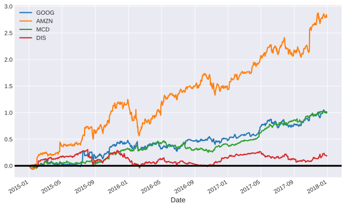
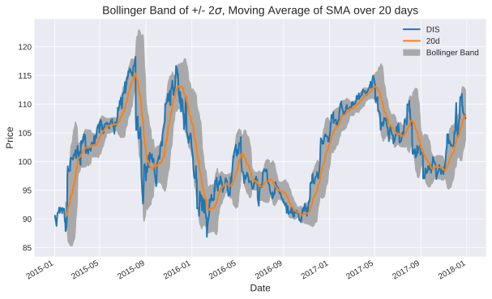

# FinQuant

<a href='https://travis-ci.org/fmilthaler/FinQuant'>
  </a>

`FinQuant` is a program for financial **portfolio management, analysis and optimisation**.

**Note**: Throughout this README, `pf` refers to the object `finquant.portfolio.Portfolio`, the object that holds all stock prices and computes its most common quantities, such as Expected Return, Volatility, and Sharpe Ratio, automatically. To make `FinQuant` an user-friendly program, that combines data analysis, optimisation and visualisation, the object provides interfaces to the main features that are provided in a number of modules in `./finquant/` and are discussed below.

## Motivation
Within a few lines of code, `FinQuant` can generate an object that holds your stock prices of your desired financial portfolio, analyses it, and can create plots of different kinds of *Returns*, *Moving Averages*, *Moving Average Bands with buy/sell signals*, and *Bollinger Bands*. It also allows for the optimisation based on the *Efficient Frontier* or a *Monte Carlo* run of the financial portfolio within a few lines of code. Some of the results are shown here.

### Automatically generating an instance of `Portfolio`
`finquant.portfolio.buildPortfolio` is a function that eases the creating of your portfolio. See below for one of several ways of using `buildPortfolio`.
```
from finquant.portfolio import buildPortfolio
names = ['GOOG', 'AMZN', 'MCD', 'DIS']
start_date = '2015-01-01'
end_date = '2017-12-31'
pf = buildPortfolio(names=names,
                    start_date=start_date,
                    end_date=end_date)
```
`pf` is an instance of `finquant.portfolio.Portfolio`, which contains the prices of the stocks in your portfolio. Then...
```
pf.data.head(3)
```
yields
```
              GOOG    AMZN        MCD        DIS
Date
2015-01-02  524.81  308.52  85.783317  90.586146
2015-01-05  513.87  302.19  84.835892  89.262380
2015-01-06  501.96  295.29  84.992263  88.788916
```

### Portfolio properties
Nicely printing out the portfolio's properties
```
pf.properties()
```
Depending on the stocks within your portfolio, the output looks something like the below.
```
----------------------------------------------------------------------
Stocks: GOOG, AMZN, MCD, DIS
Time window/frequency: 252
Risk free rate: 0.005
Portfolio expected return: 0.266
Portfolio volatility: 0.156
Portfolio Sharpe ratio: 1.674

Skewness:
       GOOG      AMZN      MCD       DIS
0  0.124184  0.087516  0.58698  0.040569

Kurtosis:
       GOOG      AMZN       MCD       DIS
0 -0.751818 -0.856101 -0.602008 -0.892666

Information:
    FMV  Name
0  0.25  GOOG
1  0.25  AMZN
2  0.25   MCD
3  0.25   DIS
----------------------------------------------------------------------
```

### Cumulative Return
```
pf.compCumulativeReturns().plot().axhline(y = 0, color = "black", lw = 3)
```
yields
<p align="center">
  
</p>

### Band Moving Average (Buy/Sell Signals)
```
from finquant.moving_average import computeMA, EMA
# get stock data for disney
dis = pf.getStock("DIS").data.copy(deep=True)
spans = [10, 50, 100, 150, 200]
ma = computeMA(dis, EMA, spans, plot=True)
```
yields
<p align="center">
  
</p>

### Bollinger Band
```
from finquant.moving_average import plotBollingerBand
# get stock data for disney
dis = pf.getStock("DIS").data.copy(deep=True)
span=20
plotBollingerBand(dis, SMA, span)
```
yields
<p align="center">
  
</p>

### Portfolio Optimisation
```
# performs and plots results of Monte Carlo run (5000 iterations)
opt_w, opt_res = pf.mc_optimisation(num_trials=5000)
# plots the results of the Monte Carlo optimisation
pf.mc_plot_results()
# plots the Efficient Frontier
pf.ef_plot_efrontier()
# plots optimal portfolios based on Efficient Frontier
pf.ef.plot_optimal_portfolios()
# plots individual plots of the portfolio
pf.plot_stocks()
```
<p align="center">
  
</p>

## Table of contents
 - [Dependencies](#Dependencies)
 - [Usage](#Usage)
 - [Portfolio](#Portfolio)
 - [Returns](#Returns)
 - [Moving Averages](#Moving-Averages)
 - [Portfolio Optimisation](#Portfolio-Optimisation)
   - [Efficient Frontier](#Efficient-Frontier)
   - [Monte Carlo](#Monte-Carlo)
 - [Examples](#Examples)
   - [Building a portfolio with `quandl`](#Building-a-portfolio-with-quandl)
   - [Building a portfolio with preset data](#Building-a-portfolio-with-preset-data)
   - [Analysis of a portfolio](#Analysis-of-a-portfolio)
   - [Optimisation of a portfolio](#Optimisation-of-a-portfolio)

## Dependencies
`FinQuant` depends on the following Python packages:
 - python>=3.5.0
 - numpy>=1.11.0
 - pandas>=0.17.1
 - matplotlib>=1.5.1
 - quandl>=3.4.5
 - scipy>=1.2.0
 - pytest>=2.8.7

## Usage
Download the code:

```git clone https://github.com/fmilthaler/FinQuant.git```

And make sure to add the directory `FinQuant` to your `PYTHONPATH`.

## Portfolio
This is the heart of `FinQuant`. `finquant.portfolio.Portfolio` provides an object that holds prices of all stocks in your portfolio, and automatically computes the most common quantities for you. To make `FinQuant` an user-friendly program, that combines data analysis, visualisation and optimisation, the object provides interfaces to the main features that are provided in the modules in `./finquant/` and are discussed below.

To learn more about the object, please read through the docstring of the module, and have a look at the examples.

Here is a list of instance variables the user has access to:
 - `portfolio`: a `pandas.DataFrame` which contains the weights/FMV (and possibly more information) about the portfolio
 - `stocks`: a `dict` of instances of `Stock`, meaning a `dict` of individual stocks
 - `data`: a `pandas.DataFrame` with the stock prices of all stocks
 - `expectedReturn`: the portfolio's expected return
 - `volatility`: the portfolio's volatility
 - `sharpe`: the portfolio's Sharpe Ratio
 - `skew`: a `pandas.Series` with the skewness of all stocks
 - `kurtosis`: a `pandas.Series` with the Kurtosis of all stocks
 - `riskFreeRate`: the risk free rate associated with the portfolio
 - `freq`: the time window/frequency of/over which the expected return and volatility are computed
 - `ef`: instance of `finquant.efficient_frontier.EfficientFrontier` which is used for finding optimial portfolios (see more below)

And here is an incomplete list of functions provided within `pf`:
 - `getStock`: Returns the instance of a Stock
 - `compCumulativeReturns`: Cumulative Returns
 - `compDailyReturns`: Percentage change of daily Returns
 - `compDailyLogReturns`: Log Return
 - `compMeanReturns`: historical mean of the daily returns
 - `compExpectedReturn`: computes the Expected Return of the portfolio
 - `compVolatility`: computes the volatility of the given portfolio
 - `compSharpe`: computes and return the Sharpe ratio of the portfolio
 - `ef_minimum_volatility`: performs an optimisation for the portfolio with the minimum volatility
 - `ef_maximum_sharpe_ratio`: performs an optimisation for the portfolio with the maximum Sharpe Ratio
 - `ef_efficient_return`: performs an optimisation for the portfolio with the minimum volatility for a given target return.
 - `ef_efficient_volatility`: performs an optimisation for the portfolio with the maximum Sharpe ratio for a given target volatility.
 - `ef_plot_efrontier`: computes and plots the *Efficient Frontier* of the portfolio
 - `ef_plot_optimal_portfolios`: computes and plots markers of the two optimal portfolios (minimum volatility/maximum Sharpe ratio)
 - `plot_stocks`: plots all stocks of the portfolio (expected (annual) return over volatility)
 - `mc_optimisation`: performs a Monte Carlo run and finds optimised portfolios
 - `mc_plot_results`: plots the results of the Monte Carlo optimisation
 - `mc_properties`: prints out the results of the Monte Carlo optimisation
 - `properties`: nicely prints out the portfolio's properties

`finquant.portfolio.Portfolio` also provides a function `buildPortfolio` which is designed to automatically generate `pf` for the user's convenience. For more information on how to use `buildPortfolio`, please read its `docstring` (do `print(finquant.portfolio.buildPortfolio.__doc__)`) and have a look at the examples.

## Returns
Daily returns of stocks are often computed in different ways. `FinQuant` provides three different ways of computing the daily returns in `finquant.returns`:
1. The cumulative return: $\displaystyle\dfrac{\text{price}_{t_i} - \text{price}_{t_0} + \text{dividend}}{\text{price}_{t_0}}$
2. Percentage change of daily returns: $\displaystyle\dfrac{\text{price}_{t_i} - \text{price}_{t_{i-1}}}{\text{price}_{t_{i-1}}}$
3. Log Return: $\displaystyle\log\left(1 + \dfrac{\text{price}_{t_i} - \text{price}_{t_{i-1}}}{\text{price}_{t_{i-1}}}\right)$

In addition to those, the module provides the function `historicalMeanReturn(data, freq=252)`, which computes the historical mean of the daily returns over a time period `freq`.

## Moving Averages
The module `finquant.moving_average` allows the computation and visualisation of Moving Averages of the stocks listed in the portfolio is also provided. It entails functions to compute and visualise the
 - `SMA`: Simple Moving Average, and
 - `EMA`: Exponential Moving Average.
 - `computeMA`: a Band of Moving Averages (of different time windows/spans) including Buy/Sell signals
 - `plotBollingerBand`: a Bollinger Band for
   - `SMA`,
   - `EMA`.

## Portfolio Optimisation
### Efficient Frontier
An implementation of the Efficient Frontier (`finquant.efficient_frontier.EfficientFrontier`) allows for the optimisation of the portfolio for
 - `minimum_volatility` Minimum Volatility,
 - `maximum_sharpe_ratio` Maximum Sharpe Ratio
 - `efficient_return` Minimum Volatility for a given expected return
 - `efficient_volatility` Maximum Sharpe Ratio for a given target volatility

by performing a numerical solve to minimise/maximise an objective function.

Often it is useful to visualise the *Efficient Frontier* as well as the optimal solution. This can be achieved with the following methods:
 - `plot_efrontier`: Plots the *Efficient Frontier*. If no minimum/maximum Return values are provided, the algorithm automatically chooses those limits for the *Efficient Frontier* based on the minimum/maximum Return values of all stocks within the given portfolio.
 - `plot_optimal_portfolios`: Plots markers of the portfolios with the Minimum Volatility and Maximum Sharpe Ratio.

For reasons of user-friendliness, interfaces to these functions are provided in `qf`. Please have a look at #Portfolio.

### Monte Carlo
Alternatively a *Monte Carlo* run of `n` trials can be performed to find the optimal portfolios for
 - minimum volatility,
 - maximum Sharpe ratio

The approach branded as *Efficient Frontier* should be the preferred method for reasons of computational effort and accuracy. The latter approach is only included for the sake of completeness, and creation of beautiful plots.

## Examples
For more information about the project and details on how to use it, please
look at the examples provided in `./example`.

**Note**: In the below examples, `pf` refers to an instance of `finquant.portfolio.Portfolio`, the object that holds all stock prices and computes its most common quantities automatically. To make `FinQuant` a user-friendly program, that combines data analysis, visualisation and optimisation, the object also provides interfaces to the main features that are provided in the modules in `./finquant/` and are discussed throughout this README.

### Building a portfolio with `quandl`
`./example/Example-Build-Portfolio-with-quandl.py`: Shows how to use `FinQuant` to build a financial portfolio by downloading stock price data through the Python package `quandl`.

### Building a portfolio with preset data
`./example/Example-Build-Portfolio-from-file.py`: Shows how to use `FinQuant` to build a financial portfolio by providing stock price data yourself, e.g. by reading data from disk/file.

### Analysis of a portfolio
`./example/Example-Analysis.py`: This example shows how to use an instance of `finquant.portfolio.Portfolio`, get the portfolio's quantities, such as
 - Expected Returns,
 - Volatility,
 - Sharpe Ratio.

It also shows how to extract individual stocks from the given portfolio. Moreover it shows how to compute and visualise:
 - the different Returns provided by the module `finquant.returns`,
 - *Moving Averages*, a band of *Moving Averages*, and a *Bollinger Band*.

### Optimisation of a portfolio
`./example/Example-Optimisation.py`: This example focusses on the optimisation of a portfolio. To achieve this, the example shows the usage of `finquant.efficient_frontier.EfficientFrontier` for optimising the portfolio. To make `FinQuant` more user-friendly,  for the
 - Minimum Volatility
 - Maximum Sharpe Ratio
 - Minimum Volatility for a given target Return
 - Maximum Sharpe Ratio for a given target Volatility.

Furthermore, it is also shown how the entire *Efficient Frontier* and the optimal portfolios can be computed and visualised. If needed, it also gives an example of plotting the individual stocks of the given portfolio within the computed *Efficient Frontier*.

Also, the optimisation of a portfolio and its visualisation based on a *Monte Carlo* is shown.

Finally, `FinQuant`'s visualisation methods allow for overlays, if this is desired. Thus, with only the following few lines of code, one can create an overlay of the *Monte Carlo* run, the *Efficient Frontier*, its optimised portfolios for *Minimum Volatility* and *Maximum Sharpe Ratio*, as well as the portfolio's individual stocks.
