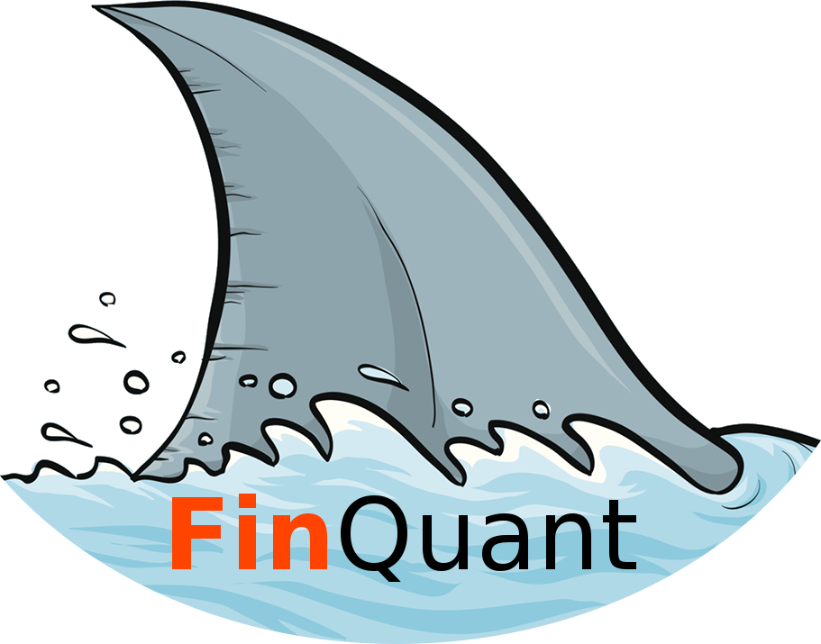
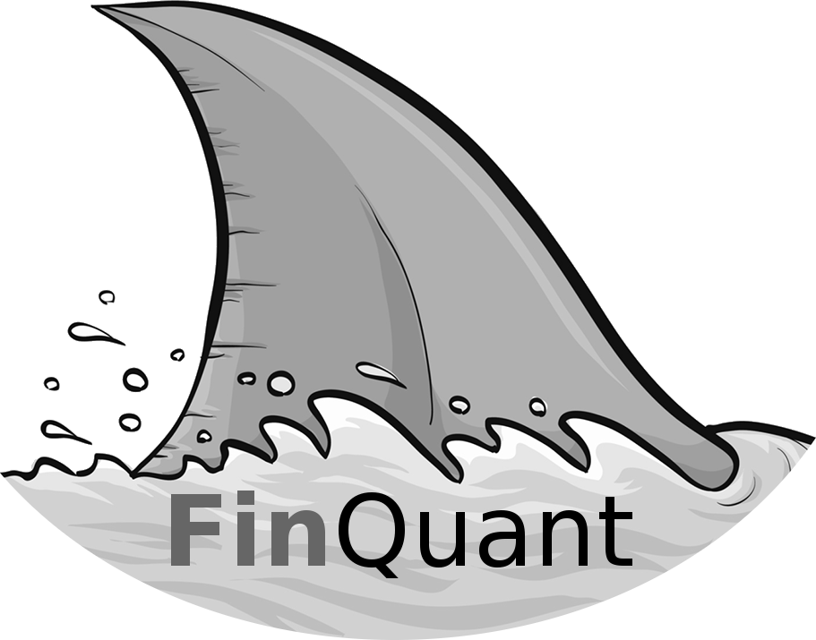

.. _index:

.. _Travis Ci: https://travis-ci.org/fmilthaler/FinQuant

.. _GitHub: https://github.com/fmilthaler/FinQuant/

.. _PyPI: https://pypi.org/project/FinQuant/

#####################################
Welcome to FinQuant's documentation
#####################################

*FinQuant* is a program for financial portfolio management, analysis and optimisation. It is designed to generate an object that holds your data, e.g. stock prices of different stocks, which automatically computes the most common quantities, such as *Expected annual Return*, *Volatility* and *Sharpe Ratio*. Moreover, it provides a library for computing different kinds of *Returns* and visualising *Moving Averages* and *Bollinger Bands*. Finally, given a set of stocks, it also allows for finding optimised portfolios.

*FinQuant* is made to be easily extended. I hope it proves itself useful for hobby investors, students, geeks, and the intellectual curious.

.. caution:: While *FinQuant* has tests in place that are run automatically by `Travis CI`_, it cannot guarantee to be bug free, nor that the analysis or optimised portfolio yield to wealth. Please use at your own discretion and refer to the :ref:`license`.

Installation
============
As it is common for open-source projects, there are several ways to get hold of the code. Choose whichever suits you and your purposes best.

Dependencies
------------

*FinQuant* depends on the following Python packages:

- ``python>=3.5.0``
- ``numpy>=1.15``
- ``pandas>=0.24``
- ``matplotlib>=1.5.1``
- ``quandl>=3.4.5``
- ``yfinance>=0.1.43``
- ``scipy>=1.2.0``
- ``pytest>=2.8.7``

From PyPI
---------
*FinQuant* can be obtained from `PyPI`_:

.. code:: text

    pip install FinQuant

From GitHub
-----------
Get the code from `GitHub`_:

.. code:: text

    git clone https://github.com/fmilthaler/FinQuant.git

Then inside ``FinQuant`` run:

.. code:: text

    python setup.py install

Alternatively, if you do not wish to install *FinQuant*, you can also download/clone it as stated above, and then make sure to add it to your ``PYTHONPATH``.

#################
Table of Contents
#################
.. toctree::
    :maxdepth: 2

    quickstart
    portfolio
    quants
    returns
    movingaverage
    efficientfrontier
    montecarlo
    examples
    license
    about

##################
Indices and tables
##################

* :ref:`genindex`
* :ref:`modindex`
* :ref:`search`
