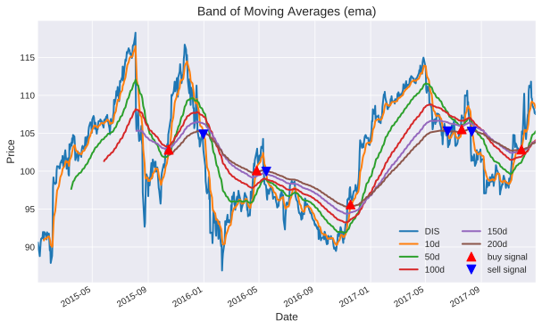

.. _quickstart:
.. _quandl: http://www.quandl.com/
.. _yfinance: https://pypi.org/project/yfinance/
.. |yahoofinance| replace:: Yahoo Finance
.. _yahoofinance: https://finance.yahoo.com/

###########
Quick Start
###########

This section covers some quick examples of *FinQuant*'s features. For a full overview please continue with the documentation, and/or have a look at :ref:`examples`.

Building a Portfolio
====================

Getting an object of ``Portfolio`` that holds stock prices of four different stocks, as well as its properties and interfaces to optimisation methods is as simple as:

.. code:: python

    from finquant.portfolio import build_portfolio
    names = ['GOOG', 'AMZN', 'MCD', 'DIS']
    pf = build_portfolio(names=names)

The above uses *Quandl* in the background to download the requested data. For more information on *Quandl*, please refer to quandl_.

If preferred, *FinQuant* also allows to fetch stock price data from |yahoofinance|_. The code snippet below is the equivalent to the above, but using yfinance_ instead (default value for ``data_api`` is ``"quandl"``):

.. code:: python

    from finquant.portfolio import build_portfolio
    names = ['GOOG', 'AMZN', 'MCD', 'DIS']
    pf = build_portfolio(names=names, data_api="yfinance")

Alternatively, if you already are in possession of stock prices you want to analyse/optimise, you can do the following.

.. code:: python

    import pathlib
    from finquant.portfolio import build_portfolio
    df_data_path = pathlib.Path() / 'data' / 'ex1-stockdata.csv'
    df_data = pd.read_csv(df_data_path, index_col='Date', parse_dates=True)
    # building a portfolio by providing stock data
    pf = build_portfolio(data=df_data)

For this to work, the data is required to be a ``pandas.DataFrame`` with stock prices as columns. 

Properties of the Portfolio
===========================

The portfolio's properties are automatically computed as it is being built. One can have a look at them with

.. code:: python

    pf.properties()

which shows

.. code::

    ----------------------------------------------------------------------
    Stocks: GOOG, AMZN, MCD, DIS
    Time window/frequency: 252
    Risk free rate: 0.005
    Portfolio Expected Return: 0.266
    Portfolio Volatility: 0.156
    Portfolio Sharpe Ratio: 1.674

    Skewness:
        GOOG      AMZN      MCD       DIS
    0  0.124184  0.087516  0.58698  0.040569

    Kurtosis:
        GOOG      AMZN       MCD       DIS
    0 -0.751818 -0.856101 -0.602008 -0.892666

    Information:
       Allocation  Name
    0        0.25  GOOG
    1        0.25  AMZN
    2        0.25   MCD
    3        0.25   DIS
    ----------------------------------------------------------------------

Moving Averages
===============

*Moving Averages* and *Bollinger Bands* can be computed and visualised with the help of the module ``finquant.moving_average``.

.. note:: When computing/visualising a *band* of Moving Averages, ``compute_ma`` automatically finds the buy/sell signals based on the minimum/maximum *Moving Average* that were computed and highlights those with arrow up/down markers.

.. code:: python

    from finquant.moving_average import compute_ma, ema
    # get stock data for Disney
    dis = pf.get_stock("DIS").data.copy(deep=True)
    spans = [10, 50, 100, 150, 200]
    # computing and visualising a band of moving averages
    ma = compute_ma(dis, ema, spans, plot=True)
    print(ma.tail())

which results in

.. code::

                   DIS         10d         50d        100d        150d        200d
    Date                                                                          
    2017-12-22  108.67  109.093968  104.810423  103.771618  103.716741  103.640858
    2017-12-26  108.12  108.916883  104.940210  103.857724  103.775063  103.685426
    2017-12-27  107.64  108.684722  105.046085  103.932621  103.826254  103.724775
    2017-12-28  107.77  108.518409  105.152905  104.008608  103.878489  103.765026
    2017-12-29  107.51  108.335062  105.245340  104.077943  103.926588  103.802290

Portfolio Optimisation
======================
*FinQuant* allows the optimisation of financial portfolios along the *Efficient Frontier* by minimising a cost/objective function. *FinQuant* uses the Python package ``scipy`` for the minimisation. Alternatively, a *Monte Carlo* approach is implemented as well. The below demonstrates how *FinQuant* performs such an optimisation and visualisation of the results.

.. code::

    # Monte Carlo optimisation
    opt_w, opt_res = pf.mc_optimisation(num_trials=5000)
    pf.mc_plot_results()
    # minimisation to compute efficient frontier and optimal portfolios along it
    pf.ef_plot_efrontier()
    pf.ef.plot_optimal_portfolios()
    # plotting individual stocks
    pf.plot_stocks()
            
.. figure:: ../images/ef-mc-overlay.svg
    :width: 85 %
    :align: center

